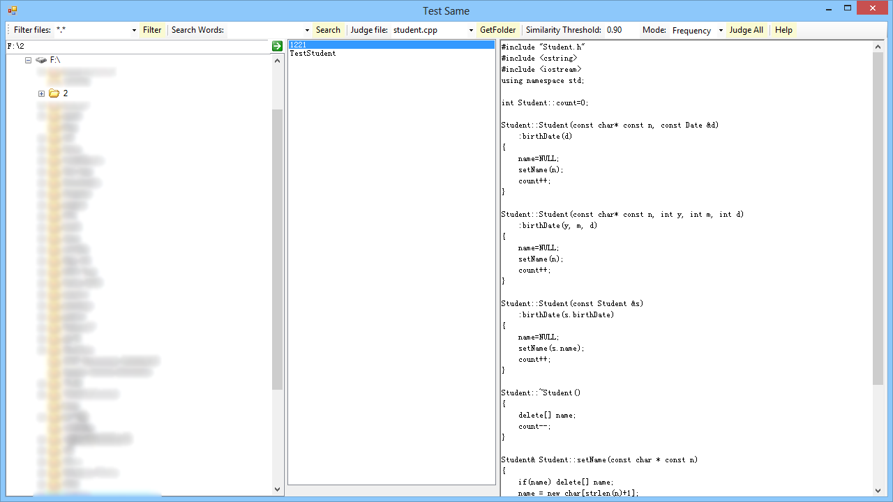
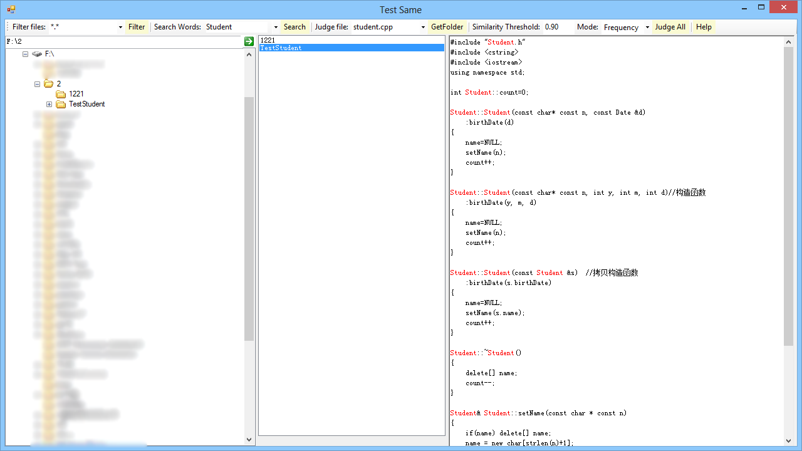
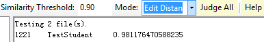

# TestSame

A tool that calculates code similarity based on .NET Framework 4.0.

## Run

- Filter Files

    用于过滤当前文件夹中的文件，得到符合特定规则的文件。

- Search Words

    搜索右侧视图中的内容，与TextBox中的字符串匹配的内容高亮。

- Judge file

    GetFolder得到当前文件夹中有哪些子文件夹，在ListView中选择某个子文件夹即可在右侧视图中看到符合TextBox中的文件名的文件内容。（这里只显示子文件夹中找到的第一个文件，搜索文件时不只搜索当前文件夹下的文件，包括子文件夹）

- Similarity

    Similarity Threshold：阈值，用于显示相似度大于等于该阈值的结果。

    Similarity Mode：判断相似度的模式：这里只提供两种，有好想法的同学可以联系我。
    假设一个文件的文件内容为一个字符串，那么有`n`个文件两两判断，需要判断`n * (n - 1) / 2`次。由于每个字符串都非常大，判断这么多次会很卡，故可用较快的方法筛选出一部分人，再用慢的方法来判断。

    1. Frequency：计算两个字符串ASCII码小于128的字符出现的频率，`相似度 = 1 - 不同的字符的数量 / 总字符数量`。这种方法效率较高，但是误差非常大，只能作为参考值。
    
    2. Edit Distance：计算两个字符串的编辑距离，`相似度 = 1 - 编辑距离 / 总字符数量`。

从上面两张图可以看到，第一份代码把下面的参考代码的中文注释删掉，几乎就没有太大的改动了，然后用Edit Distance反馈的结果是

## Compile

Requirements:

- Visual Studio 2010
- .NET Framework 4.0
